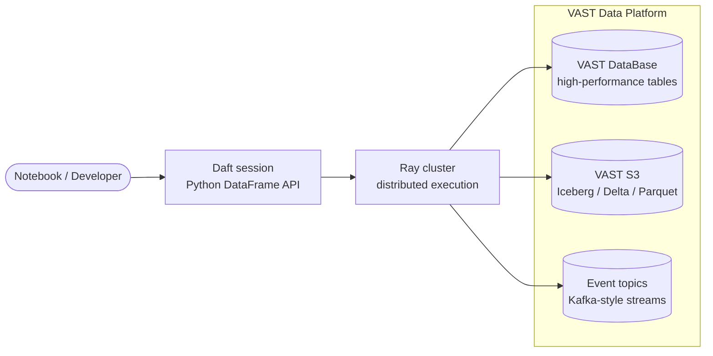

# Daft + VAST: One Notebook Across Database, S3, and Events

Most data notebooks start simple and then slowly turn into plumbing.

First you query the operational database. Then you need a dimension table from the lake. Then you need credentials for object storage, a different API for the catalog, a different mental model for distributed execution, and a few helper functions that nobody wants to maintain.

I wanted the opposite: one notebook, one DataFrame API, and one clean path from exploration to distributed execution across the places data already lives.

That is where VAST and Daft fit well together. VAST can be the one-stop shop for high-performance database tables, S3-compatible object storage, open lakehouse formats, and event-driven data. Daft gives developers one Python DataFrame interface to query across those sources.

In the demo, Daft reads a 350 million row orders table from VAST DataBase, joins it to product data, and runs a business aggregation in **6.27 seconds** on a small Ray cluster. Add a filter that keeps about 20% of the orders, and the same analysis finishes in **3.76 seconds** because the predicate is pushed down into VAST before the data reaches Ray.

That is the interesting part: the notebook still looks like normal Daft, but VAST is doing meaningful work underneath.

## Why This Matters

Analytical notebooks are often forced into a compromise.

If the data lives in an operational system, teams usually extract it somewhere else before they analyze it. That copy might land in Parquet, Iceberg, a warehouse, or a separate vector database. Each copy adds delay, cost, governance overhead, and another place where data can drift.

If the data lives only in a lake, notebooks are easy to scale, but they are often separated from the most current operational state.

The VAST story is different. VAST is designed as a data platform where high-performance storage, database tables, S3 object access, event-driven pipelines, and AI-oriented workloads can live together. Daft adds a modern Python DataFrame layer on top, so developers can work across these systems without constantly changing tools.

Use VAST DataBase when a table needs database performance, pushdowns, fast metadata, and live operational access. Use Iceberg, Delta, or plain Parquet on VAST S3 when other systems already produce open lakehouse data. Use event topics when the data is arriving continuously and should be part of the same analytical workflow.

Daft can sit above all of it. The operational data stays in VAST DataBase. The lakehouse data stays on VAST S3. Event data can be explored as another source. The notebook reads them through catalogs and plans the work across Ray.

No export step. No staging table. No separate benchmark-only format conversion.

## A Quick VAST Primer

VAST is best known for building a high-performance data platform for AI, analytics, and large-scale data services. The storage foundation, VAST DataStore, is an all-flash system designed to scale from terabytes to exabytes while serving file, object, and database workloads from the same platform.

The architecture behind it is called **DASE**, short for Disaggregated and Shared Everything. In plain terms, VAST separates compute from storage, but keeps the data globally accessible to the compute layer. That matters for distributed analytics because workers can fan out without each one being tied to a fixed shard of data.

VAST DataBase is the structured data layer on that platform. VAST positions it as a way to bring transactional, analytical, and vector workloads together. For data teams, the practical benefit is straightforward: operational tables can also be useful analytical tables, and AI data does not have to be moved into yet another specialized system before it can be explored.

VAST S3 gives the same platform an object interface for lakehouse data. That matters because many systems already write Iceberg, Delta, or Parquet. You do not always get to choose the format, and you should not have to move the data just to analyze it.

VAST DataEngine brings event-driven compute into the same platform story. For this blog, the important idea is simple: batch data, operational data, object data, and event data should not force four separate notebook experiences.

That is exactly the kind of platform Daft should be able to use well.

## One Platform, One DataFrame Layer



The value of the diagram is the shape, not the boxes. A data team should be able to pick the right storage model for each workload without forcing developers to learn a new access pattern every time.

VAST DataBase is the right home for high-performance tables that benefit from database semantics and pushdowns. VAST S3 is the right home for open lakehouse data produced by Spark, Flink, ingestion tools, or external systems. Event topics are the right home for continuously arriving data. Daft is the layer that lets a notebook ask questions across them.

## The Developer Experience

The integration is intentionally small from the notebook author's point of view.

You attach VAST catalogs to a Daft session. You attach an Iceberg catalog to the same session. Then you read tables by name.

```python
sess.attach_catalog(vast_db_catalog)
sess.attach_catalog(vast_s3_iceberg_catalog)
sess.attach_catalog(vast_events_catalog)

sess.set_catalog("vast_db")
orders = sess.read_table("orders")

sess.set_catalog("vast_s3")
customers = sess.read_table("customers")

sess.set_catalog("vast_events")
clicks = sess.read_table("clickstream")

result = (
    orders
    .join(customers, on="customer_id")
    .join(clicks, on="customer_id")
    .where(daft.col("amount") > 400)
    .groupby("tier")
    .agg(daft.col("order_id").count().alias("orders"))
)
```

The exact catalog names are deployment details. The important point is that the notebook is just Daft: joins, filters, projections, aggregations, and limits. The table may come from VAST DataBase, Iceberg on VAST S3, or an event topic, but the code does not turn into connector-specific glue.

That is important for adoption. A team already using Daft should not need to rewrite its workflow to try VAST. A team already using VAST should not need to teach every notebook author the lower-level database API before they can run an analysis.

## The Demo

The demo uses a simple commerce-style workload:

- 350 million orders in VAST DataBase
- Product data in VAST DataBase
- Customer data in Iceberg on VAST S3
- Clickstream or event-style data as another catalog source
- Daft running distributed on Ray in Kubernetes

The main query joins orders to products and calculates margin by product category. A second version applies a filter first, keeping roughly 70 million of the 350 million orders.

The full-table aggregation finished in **6.27 seconds**. The filtered version finished in **3.76 seconds**.

The point is not that every query will have exactly that speedup. The point is that the shape is right: when the notebook asks for less data, VAST can do less work and send less data to Ray. The DataFrame code stays clean, but the storage layer is still participating in the plan.

There is also a smaller but useful proof point: counting the 350 million row VAST table can be answered from table statistics in about **25 milliseconds** once the system is warm. That is the kind of interaction that makes notebooks feel responsive instead of ceremonial.

## What VAST Is Doing Under the Hood

You do not need to understand the internals to use the integration, but the performance comes from a few important behaviors.

Daft can ask VAST DataBase for table statistics instead of scanning data for simple counts. Filters can become VAST predicates, so rows that do not match are discarded before they leave the database. Column projection means the scan does not have to carry unnecessary fields through the network and into Ray. Splits let Ray workers read in parallel.

For S3 data, Daft can work with open table and file formats such as Iceberg, Delta, and Parquet. That is useful when another system already produced the data and VAST is serving it through S3. For event data, the same notebook can bring fresh streams into the analysis instead of treating them as a separate operational concern.

Those details are easy to hide behind an API, but they are the difference between "a connector exists" and "the connector is worth using."

For VAST customers, this is the marketing-relevant part: the platform is not just a place where the data sits. It actively improves the notebook experience by reducing movement, reducing wait time, and letting compute scale out against the same shared data platform.

## Why Daft Fits

Daft is a good match because it gives Python users a familiar DataFrame experience while scaling across Ray. It already has strong public benchmark results on analytical workloads, including TPC-H runs over Parquet in S3 where Daft reports significantly faster end-to-end times than Spark in its published setup.

This integration is complementary to those results. It keeps Daft's developer experience and distributed execution model, but lets VAST DataBase behave like a native high-performance table source instead of an external system that has to be dumped into files first. It also keeps VAST S3 and event data in the same notebook story.

That combination is useful for AI and analytics teams that want fast iteration without building another data movement pipeline.

## What This Means For A VAST Environment

For a team already running VAST, the adoption path is intentionally short:

- Install the `vast-daft` package on the Ray cluster.
- Attach a `VastDBCatalog` to the Daft session.
- Read VAST DataBase tables with `sess.read_table(...)`.
- Join them with Iceberg, Delta, or Parquet data on VAST S3 when the analysis needs lakehouse data.
- Bring in event topics when the analysis needs fresh stream data.

The data remains on VAST. Daft becomes the notebook and execution layer. Ray provides distributed compute. VAST DataBase, VAST S3, and event streams stay available for the workloads they fit best.

That is a cleaner story than "copy the data somewhere else and hope the copy is fresh."

## The Takeaway

The headline number is easy to remember: **350 million rows aggregated in 6.27 seconds**, or **3.76 seconds** when a selective predicate is pushed into VAST.

But the bigger takeaway is the workflow. A notebook can work across VAST DataBase, open lakehouse data on VAST S3, and event data using one Daft session, while VAST still contributes the platform-level capabilities that make the query fast.

For technical teams evaluating VAST, that is the kind of integration that matters. It does not just expose data. It makes the data easier to use, faster to explore, and simpler to adopt from the tools developers already want to use.

References: [VAST Data Platform](https://www.vastdata.com/platform), [VAST DataBase](https://www.vastdata.com/platform/database), [VAST DataStore](https://www.vastdata.com/datastore), [VAST DataEngine](https://www.vastdata.com/platform/dataengine), [Daft benchmarks](https://docs.daft.ai/en/stable/benchmarks/).
