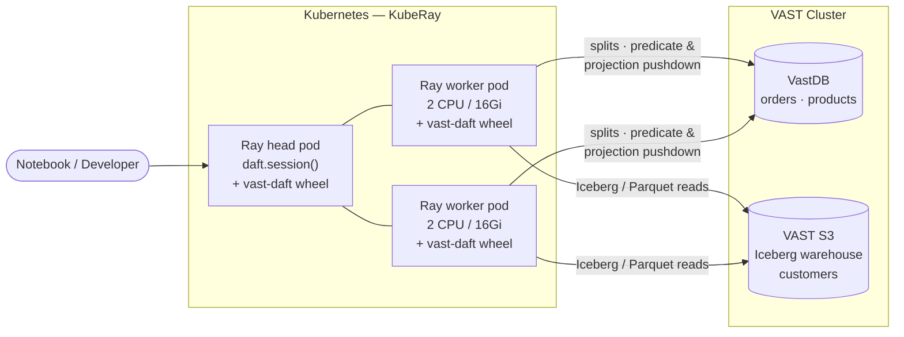

# Daft + VastDB + Iceberg: 350M Rows, One DataFrame API

I wanted one notebook. Open it, query an operational table in VastDB, join it to Iceberg data on VAST S3 when needed, and run the whole thing distributed on Ray — without juggling three APIs.

It works. A 350M-row VastDB orders table joined to a VastDB products table materializes a full-table business aggregation in **6.27s**. Add a predicate that keeps about 20% of the rows, and the same aggregation finishes in **3.76s**. The query is plain Daft DataFrame code; the storage layer still gets metadata counts, predicate pushdown, projection pushdown, and split-based parallel reads.

(This is not "VastDB beats Parquet." That is a different post. This one is about the integration actually doing its job.)

## How the pieces fit



The Daft session attaches two catalogs — a `VastDBCatalog` and a PyIceberg `SqlCatalog` — and the same `sess.read_table(...)` call works against either backend.

## The Query

The benchmark models a small commerce workload:

- `orders`: 350,000,000 rows in VastDB
- `products`: 10 rows in VastDB
- `customers`: 10,000 rows in Iceberg on VAST S3

The main benchmark joins orders to products and computes gross margin as `amount - cost_price`. The notebook also attaches an Iceberg customers table for cross-backend queries that need customer attributes.

(Yes, 10 products and 10K customers against 350M orders is lopsided on purpose. The point is the 350M side; products and customers are there to make the joins real.)

```python
sess.set_catalog("vast")
orders = sess.read_table("orders")
products = sess.read_table("products")

sess.set_catalog("s3_iceberg")
customers = sess.read_table("customers")
```

The cross-backend joins are plain Daft:

```python
enriched = (
    orders
    .join(products, on="product", how="inner", strategy="broadcast")
    .select(
        "order_id",
        "customer_id",
        "product",
        "category",
        "amount",
        "cost_price",
        "order_date",
    )
)

full = (
    enriched
    .join(customers, on="customer_id", how="inner", strategy="broadcast")
    .select(
        "order_id",
        "customer_id",
        "name",
        "tier",
        "product",
        "category",
        "amount",
        "cost_price",
        "order_date",
    )
)
```

And the aggregations are normal DataFrame operations:

```python
margin_by_category = (
    enriched
    .with_column("margin", daft.col("amount") - daft.col("cost_price"))
    .groupby("category")
    .agg(
        daft.col("margin").sum().alias("total_margin"),
        daft.col("margin").mean().alias("avg_margin"),
        daft.col("order_id").count().alias("order_count"),
    )
    .sort("total_margin", desc=True)
)

margin_by_tier_category = (
    full
    .with_column("margin", daft.col("amount") - daft.col("cost_price"))
    .groupby("tier", "category")
    .agg(
        daft.col("margin").sum().alias("total_margin"),
        daft.col("order_id").count().alias("order_count"),
    )
    .sort("total_margin", desc=True)
    .limit(15)
)

top_customers = (
    full
    .groupby("customer_id", "name", "tier")
    .agg(
        daft.col("amount").sum().alias("total_spend"),
        daft.col("order_id").count().alias("order_count"),
        daft.col("amount").mean().alias("avg_order"),
    )
    .sort("total_spend", desc=True)
    .limit(20)
)
```

Nothing clever in there. That is the point.

## The numbers

Run context — small on purpose, so any blow-up shows up loudly:

- KubeRay cluster in Kubernetes
- 1 Ray head pod, configured with `num-cpus=2`
- 2 Ray worker pods, each limited to `2 CPU / 16Gi`
- VastDB endpoint in the same Kubernetes network
- Iceberg warehouse stored on VAST S3

Setup and metadata:

| Step | Time |
|---|---:|
| Create lazy DataFrames through `sess.read_table()` | 0.45s |
| Fetch all three table counts, first pass including Ray task startup | 2.50s |
| Fetch 350M-order count from VastDB stats, warmed up | 0.02-0.03s |

The fun number here is the warm count: **350M rows in about 25ms**, because VastDB answered from table stats instead of scanning anything. The cold 2.50s included three counts across VastDB and Iceberg plus first-use Ray task startup.

Table sizes:

| Table | Backend | Rows | Columns |
|---|---|---:|---:|
| orders | VastDB | 350,000,000 | 5 |
| products | VastDB | 10 | 17 |
| customers | Iceberg on VAST S3 | 10,000 | 3 |

Materialized query results:

| Query | Rows reaching aggregate | Time |
|---|---:|---:|
| Join all orders + products, compute margin, aggregate by product category | 350,000,000 | 6.273s |
| Push down `amount >= 401`, join orders + products, aggregate by product category | 69,994,609 | 3.757s |

The second query keeps almost exactly **20%** of the orders. It is not 5x faster, because there is still fixed Ray, join, and aggregation work, but the predicate eliminates about **280M rows** before they leave VastDB and cuts wall time by about **40%**.

The filtered query is the more common notebook shape: filter first, then aggregate. That is where storage-side pushdown earns its keep — the predicate runs on the VastDB side, so the rows that fail the filter never leave the database.

## Why a catalog, not a reader function

The first version of this connector was a `read_vastdb(...)` helper. It worked, but it never felt like part of Daft — every notebook had to remember which tables came from where. Wiring VastDB through Daft's catalog API instead got rid of that friction. `VastDBCatalog` implements:

- `list_tables`
- `get_table`
- `create_table`
- `drop_table`
- `has_table`
- `read_table` through a Daft session

That makes VastDB behave like a first-class table backend:

```python
from vast_daft import VastDBCatalog, VastDBConfig

vast = VastDBCatalog(
    VastDBConfig(
        endpoint=VASTDB_ENDPOINT,
        access_key=S3_ACCESS_KEY,
        secret_key=S3_SECRET_KEY,
        bucket="collections-bucket",
        schema="collections-schema",
    ),
    alias="vast",
)

sess = daft.session()
sess.attach_catalog(vast)
sess.attach_catalog(iceberg_catalog)
```

From there, the notebook uses `sess.set_catalog(...)` and `sess.read_table(...)` for both VastDB and Iceberg. The benchmark reads like table logic, not connector plumbing.

## What the storage layer is actually doing

Daft already has strong published results on analytical workloads over Parquet in S3 — its TPC-H page reports the 100 GB run in **785s** versus Spark at **2648s**, and the 1 TB run in **7774s** versus Spark at **27161s**. Those are Daft engine benchmarks, not VastDB benchmarks. The integration here is doing something different: keeping Daft's Python API and Ray execution model, while letting VastDB participate as a native table source.

In practice that means a few storage-side hooks fire under the DataFrame API:

- `count()` uses VastDB table stats instead of scanning files.
- Filters become VastDB predicates.
- Column projection reduces data before it crosses the wire.
- Splits are generated from VastDB metadata and executed across Ray workers.
- The same session plans over VastDB and Iceberg tables.

The easiest one to see in this run is metadata pushdown — that 25ms count, served from VastDB stats. Projection matters too: the query only needs the order columns used by the join and aggregations, so the scan avoids dragging unrelated columns through Ray.

Narrow result, but useful: Daft drives large VastDB-backed joins through its catalog API with very little notebook code.

## The bug I had to fix to make this work

I almost shipped this without column projection working. While wiring it in I tripped a Daft P0: custom `DataSource` scans could land at `HashJoin` with an incomplete column set after a `select()` or `groupby().agg()`, and the executor would panic. Fun.

Filed [#6500](https://github.com/Eventual-Inc/Daft/issues/6500), fixed in [#6501](https://github.com/Eventual-Inc/Daft/pull/6501). Once the failing plan was minimized the change was small — make Daft preserve the full column set the downstream operators actually need. The Daft maintainers were quick on review, which is the only reason this stayed a side quest instead of a fork.

The reason it matters for the post: without that fix, projection pushdown after join-heavy plans would not be reliable, and the 350M-row numbers above would be a lot less interesting.

## What I actually got

Not "Daft can read VastDB." That is a low bar. The thing I wanted is a single Daft session that plans across a **VastDB table and an Iceberg table without copying data between them**, while VastDB still contributes database-like scan behavior underneath the DataFrame API.

That is the stack I wanted for notebooks: Python ergonomics, distributed execution, native VastDB tables, and open Iceberg tables on VAST S3.

Next benchmark: same 350M-row query, VastDB versus Parquet-on-S3, plus pushdown on/off.

References: [Daft benchmarks](https://docs.daft.ai/en/stable/benchmarks/), [Daft distributed query benchmark repo](https://github.com/Eventual-Inc/distributed-query-benchmarking), [Daft issue #6500](https://github.com/Eventual-Inc/Daft/issues/6500), [Daft PR #6501](https://github.com/Eventual-Inc/Daft/pull/6501).
